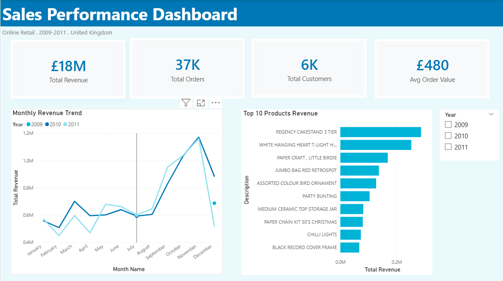
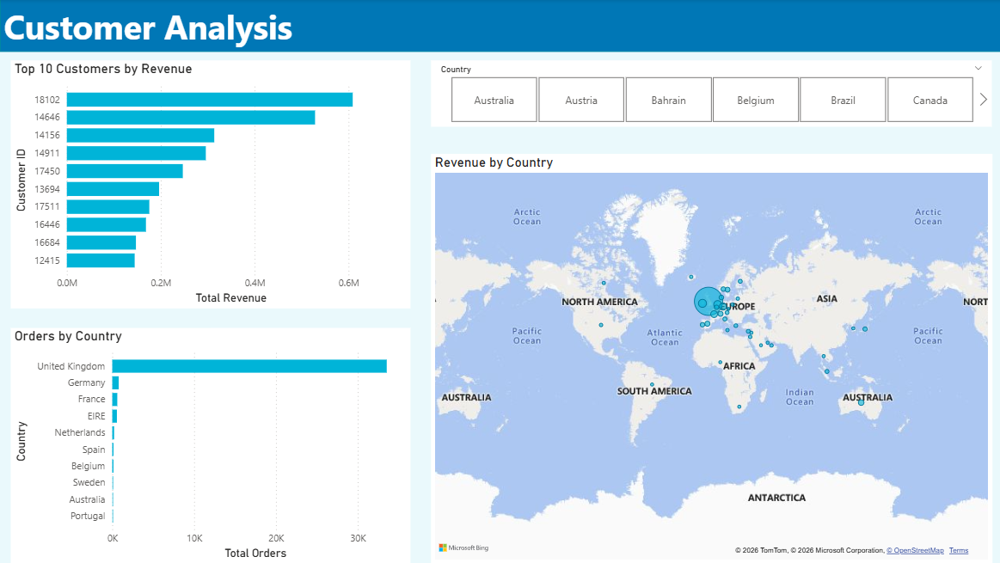
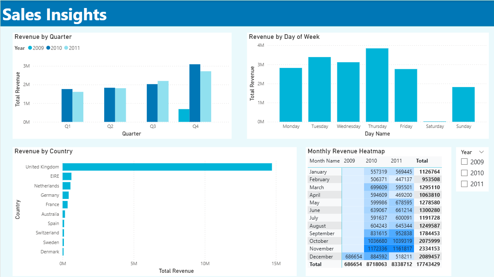

# Online Retail Sales Dashboard — Power BI


A multi-page interactive sales dashboard built in Power BI, analysing transactional data from a UK-based online retailer across 2009–2011. The project covers the full analytics workflow — from raw data ingestion and cleaning to DAX modelling and interactive visualisation.

---

# Dashboard Pages

# Page 1 — Sales Overview
High-level KPIs and revenue trends across the full dataset period.



**Visuals:**
- KPI Cards: Total Revenue, Total Orders, Total Customers, Avg Order Value
- Monthly Revenue Trend (line chart with year-over-year comparison)
- Top 10 Products by Revenue (bar chart)
- Year slicer for interactive filtering

---

# Page 2 — Customer Analysis
Geographic and customer-level breakdown of sales performance.



**Visuals:**
- Top 10 Customers by Revenue (bar chart)
- Revenue by Country (map visual with bubble sizing)
- Orders by Country (bar chart)
- Country slicer for interactive filtering

---

# Page 3 — Sales Insights
Time intelligence and behavioural patterns in the sales data.



**Visuals:**
- Revenue by Quarter (clustered column chart)
- Revenue by Day of Week (column chart)
- Revenue by Country — exact figures (bar chart)
- Monthly Revenue Heatmap (matrix with conditional formatting)
- Year slicer for interactive filtering

---

# Key Insights

- **£18M Total Revenue** generated across 2009–2011 from 37K orders and 6K unique customers
- **Q4 drives ~35% of annual revenue** — November is consistently the strongest month, driven by Christmas demand
- **Thursday is the peak trading day** — near-zero weekend activity confirms a predominantly B2B customer base
- **The UK accounts for ~85% of all orders** — Germany, France, and EIRE are the top international markets
- **Customer 18102 is the single highest-value customer** at ~£0.6M — nearly double the second-ranked customer
- **2009 data is partial** (November–December only) — full year comparisons are made between 2010 and 2011

---

# Dataset

| Property | Detail |
|---|---|
| Source | [UCI Machine Learning Repository](https://archive.ics.uci.edu/dataset/502/online+retail+ii) |
| Records | ~1 million transactions |
| Period | December 2009 – December 2011 |
| Geography | UK-based retailer with international customers |
| Format | Excel (.xlsx) with two sheets (one per year) |

---

# Tools & Techniques

# Power Query
- Appended two yearly sheets into a single unified table
- Removed cancelled orders (Invoice prefix 'C')
- Filtered out negative quantities and zero prices
- Stripped time component from InvoiceDate for relationship compatibility
- Created a calculated `Revenue` column (Quantity × Price)

# Data Modelling
- Built a dedicated `DateTable` using DAX CALENDAR function
- Established a one-to-many relationship between DateTable and Online Retail
- Followed star schema principles for clean model design

# DAX Measures
```
Total Revenue = SUM('Online Retail'[Revenue])
Total Orders = DISTINCTCOUNT('Online Retail'[Invoice])
Total Customers = DISTINCTCOUNT('Online Retail'[Customer ID])
Avg Order Value = DIVIDE([Total Revenue], [Total Orders])
Total Quantity = SUM('Online Retail'[Quantity])
Avg Daily Revenue = DIVIDE([Total Revenue], DISTINCTCOUNT('Online Retail'[InvoiceDate]))
```

# Visualisation
- Custom JSON theme for consistent color palette
- Conditional formatting on heatmap matrix
- Top N filters for dynamic rankings
- Cross-page slicers for interactive filtering
- Subtle shadow effects for professional card styling

---

# Repository Structure

```
online-retail-dashboard/
├── OnlineRetailDashboard.pbix    # Power BI report file
├── README.md                     # Project documentation
└── screenshots/
    ├── sales_overview.png        # Page 1 screenshot
    ├── customer_analysis.png     # Page 2 screenshot
    └── sales_insights.png       # Page 3 screenshot
```

# How to View

1. Download [Power BI Desktop](https://powerbi.microsoft.com/desktop) (free)
2. Clone or download this repository
3. Open `OnlineRetailDashboard.pbix` in Power BI Desktop
4. The dataset is embedded in the .pbix file — no additional setup needed

# Author

Built as a portfolio project to demonstrate end-to-end Power BI development skills including data ingestion, Power Query transformation, DAX modelling, and dashboard design.
